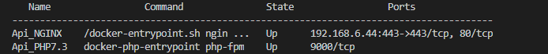

<p align="center"></p>

# Docker-Compose para generar un ambiente de desarrollo base de PHP7.X y NGINX

**NOTA:** Antes de modificar este archivo clone el repositorio de su proyecto y se sugiere que se coloque dentro de la ruta */var/www/html* .

## **Configuración Inicial**

Primero se tiene que tener instalado Docker y Docker-compose.

Después de clonar el proyecto y entrar a la carpeta del proyecto se debe realizar lo siguiente:

### **Crear la carpeta Log**

Esta carpeta se debe crear en la raiz del proyecto de docker para posteriormente ver los logs del sistema ya en ejecución. Dentro de su editor crear la carpeta log y dentro de la carpeta log crear otra carpeta llamada nginx. En la terminal ejecutar el siguiente comando.

```bash
$ mkdir log
$ mkdir log/nginx
```

### **Archivo docker-compose.yml**

Dentro del archivo docker-compose.yml editar las siguientes lineas de 10 y 17 si el proyecto se coloco dentro de otra ruta, de no ser así deje el código tal cual en el ejemplo y solo coloque el nombre del proyecto:

`
  volumes:
`
<br>
`
       - /var/www/html/nombre_proyecto:/var/www/html/nombre_proyecto
`

Por ultimo editar el puerto en la lina 23 que se encuentra del lado izquierdo **(8080)**, el puerto 80 que se encuetra del lado derecho se queda igual:

`
      ports:
`<br>
`
       - "8080:80" # Puerto para sitio
`

Guardar cambios.

### Archivo Dockerfile

Este archivo puede dejarlo así pero de acuerdo a las necesidades del proyecto puede instalar módulos PHP aqui puede escojer la version de la imagen de php. Se adjunta las URL de la documentación sobre como instalar módulos en esta imagen de PHP.

https://github.com/mlocati/docker-php-extension-installer


### Archivo de confifuración nginx

Entrar a la carpeta nginx y con su editor de código o terminal editar el archivo en lo siguiente:

- Linea 9 del archivo si la ruta del proyecto es distinta, si no dejar la linea como el ejemplo:

`
root /var/www/html/nombre_proyecto/public;
`

- Linea 12 del archivo donde colocara el dominio del sitio o la dirección ip:

`
server_name 192.168.xxx.xxx midominio;
`
Si tiene más configuración agregelas a este archivo.

Guardar cambios.

### Levantando los contenedores Docker

Una vez terminado las adecuaciones en los archivos de configuración, en su terminal se debe ejcutarlos los siguientes comandos en la raiz del proyecto docker.

Ejecute el siguiente comando en la raiz del proyecto:

```bash
$ docker-compose up -d --build
```
Si el proyecto marca errores favor de volver a revisar los archivos que se modificaron de no ser así ejecute el siguiente comando para corrobar que se levantaron los contenedores de NGINX y PHP:

```bash
$ docker ps
```
Mostrara un listado similar a la siguiente imagen:
<p align="center"></p>

Por ultimo paso corroborar que el sitio este levantado.<br>
**NOTA**: Si el proyecto no se muestra como en la imagen, verificar los permisos del proyecto o la configuración que necesita.<br>